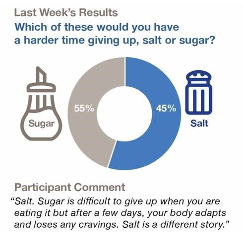
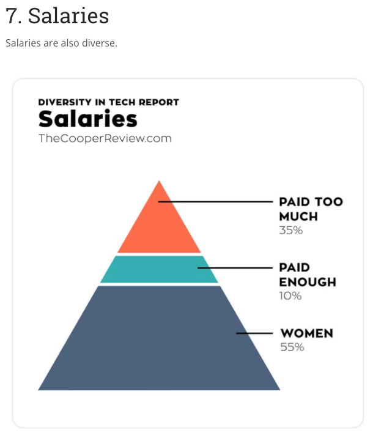
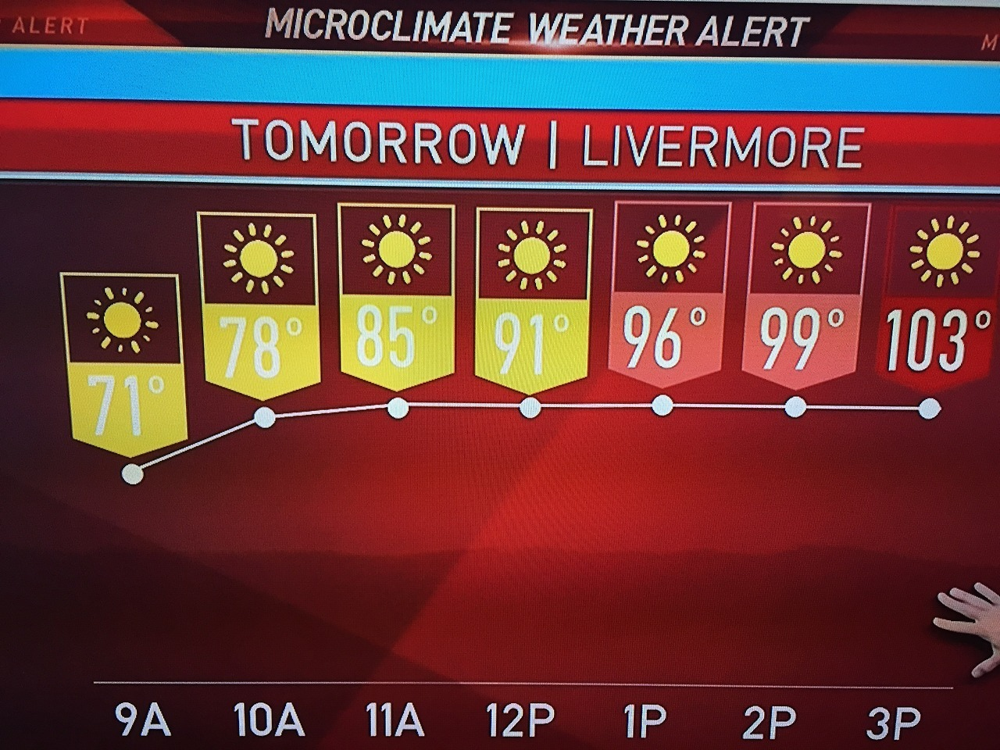
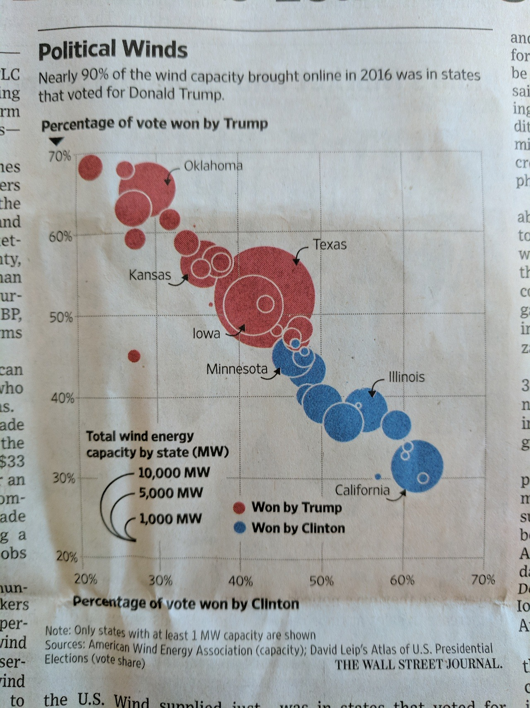
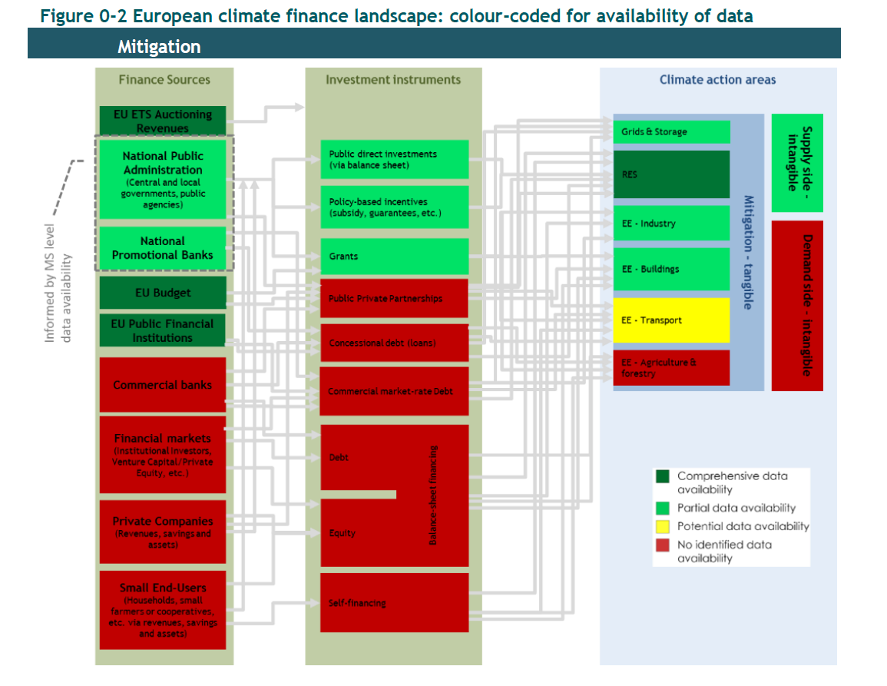
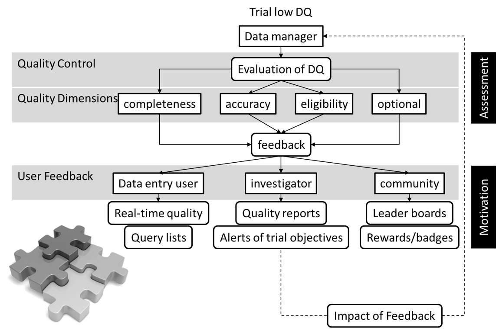

```{r setup, include=FALSE}
options(htmltools.dir.version = FALSE)
library(tidyverse)
library(plotly)
library(viridis)
library(lvplot)
library(gapminder)
library(networkD3)
library(DT)
library(formattable)
library(VIM)
```

class: inverse, center, middle


# Übersicht

<h2>1. Grundsätze der Datenvisualisation</h2> 

<h2>2. Methodik</h2>

<h2>3. Tabellen und Graphen</h2>

<h2>4. Zusammenfassung</h2>


---

# 1. Grundsätze der Datenvisualisation I

.pull-left[

> The simple graph has brought more information to the data analyst’s mind than any other device.
— John Tukey

Sechs wichtige Aspekte: 

> 1. Verstehe den Kontext
> 2. Wähle eine passende Art von Graph oder Tabelle
> 3. Säubere die Darstellung
> 4. Richte die Aufmerksamkeit auf die Aussage
> 5. Denke wie ein Designer
> 6. Erzähle eine Geschichte

> — Cole Nussbaumer Knaflic

]


.pull-right[
```{r echo=FALSE, message=FALSE, warning=FALSE}
# source https://plot.ly/r/animations/

gapminder %>%
  plot_ly(
    x = ~gdpPercap, 
    y = ~lifeExp, 
    size = ~pop, 
    color = ~continent, 
    frame = ~year, 
    text = ~country, 
    hoverinfo = "text",
    type = 'scatter',
    mode = 'markers'
  ) %>%
  layout(
    xaxis = list(
      type = "log"
    )
  )
```
]

---
# 1. Grundsätze der Datenvisualisation II

<div align="center">
  
</div>  
---
# 1. Grundsätze der Datenvisualisation II

<div align="center">
  
</div>  
---
# 1. Grundsätze der Datenvisualisation II

<div align="center">
  
</div>  
---
# 1. Grundsätze der Datenvisualisation II

<div align="center">
  
</div>  
---
# 1. Grundsätze der Datenvisualisation II

<div align="center">
  
</div>  
---
# 1. Grundsätze der Datenvisualisation II

<div align="center">
  
</div>  
---
# 1. Grundsätze der Datenvisualisation II

<div align="center">
  
</div>

Abiy et al. (2018)

---

# 1. Grundsätze der Datenvisualisation III

Frage: Wie verbessere ich die Datenqualität?

<div align="center">
  
</div>
---
class: inverse, middle, center

# 2. Methodik

---

# 2. Methodik

* Programmierung: R

* Datenmanipulation: `dplyr`, `tidyr`

* Datenexploration: `summarytools`

* Kommunikation: `rmarkdown`, htmlwidgets, `flexdashboard`

* Pakete für Graphen: `ggplot2`, `plotly`, `lvplot`, `ggthemes`

* Pakete für Tabellen: `knitr`, `DT`, `formattable`

* Farbpalette: `viridis`

* Daten: US Foodbourne Disease Outbreaks, 1998 - 2015. [Quelle: Kaggle](https://www.kaggle.com/cdc/foodborne-diseases)

---
class: inverse, middle, center

# 3. Tabellen und Graphen

---

# 3. Tabellen und Graphen
```{r echo=FALSE, warning=FALSE, message=FALSE}
df <- read_csv("data/outbreaks.csv")
df.sum <- df %>% 
  select(Year, Fatalities, Hospitalizations)
```


```{r warning=FALSE, message=FALSE}
library(summarytools)
print(dfSummary(df.sum, style = "grid", plain.ascii = FALSE, graph.magnif = 0.85), 
      method = "render", omit.headings = TRUE)
```

---

# 3. Tabellen und Graphen

.pull-left[
```{r echo=FALSE, warning=FALSE, message=FALSE}
varis <- c("Florida", "California")
g2 <- df %>% 
  add_count(Year, State) %>% 
  add_count(State) %>% mutate(per = n/nn) %>% 
  select(Year, State, n, nn, per) %>% 
  filter(grepl(paste(varis, collapse = "|"), 
               State)) %>% 
  distinct() %>% 
  ggplot(aes(Year, per, color = State)) +
  geom_line() + theme_classic() + xlab("") +
  ylab("") + ggtitle("Cases per State in %") + 
  scale_color_brewer(palette = "Set1", 
                     type ="qual") +
  geom_point(aes(x = 2014, 
                 y = 0.032378, size = 3)) +
  annotate("text", x = 2013, y = 0.045, 
           label = "Fish: Ciguatoxin\nOutbreak", 
           fontface="italic") +
  scale_size_continuous(guide = "none")
ggplotly(g2) %>% 
  layout(legend = list(x = 0.75, y = 0.8))
```
]

.pull-right[
```{r eval=FALSE}
varis <- c("Florida", "California")
g2 <- df %>% 
  add_count(Year, State) %>% add_count(State) %>% 
  mutate(per = n/nn) %>% 
  select(Year, State, n, nn, per) %>% 
  filter(grepl(paste(varis, collapse = "|"), 
               State)) %>% distinct() %>% 
  ggplot(aes(Year, per, color = State)) +
  geom_line() + theme_classic() + xlab("") +
  ylab("") + ggtitle("Cases per State in %") + 
  scale_color_brewer(palette = "Set1", 
                     type ="qual") +
  geom_point(aes(x = 2014, 
                 y = 0.032378, size = 3)) +
  annotate("text", x = 2013, y = 0.045, 
           label = "Fish: Ciguatoxin\nOutbreak", 
           fontface="italic") +
  scale_size_continuous(guide = "none")
ggplotly(g2) %>% 
  layout(legend = list(x = 0.75, y = 0.8))
```
]


---

# 3. Tabellen und Graphen

.pull-left[
```{r echo=FALSE, message=FALSE, warning=FALSE}
g <- df %>% 
  summarise_all(funs(countNA)) %>% 
  gather(Variable, missings) %>% 
  mutate(miss_per = missings/nrow(df)*100) %>% 
  ggplot(aes(reorder(Variable, miss_per), miss_per, fill = miss_per)) +
  geom_bar(stat = "identity") +
  scale_fill_viridis_c(option = "C", guide = "none") +
  coord_flip() +
  theme_classic() +
  xlab("") +
  ylab("") +
  ggtitle("Missing values per Variable (in Percent)")
ggplotly(g) %>% 
  layout(showlegend = FALSE)
```
]

.pull-right[
```{r eval=FALSE}
g <- df %>% 
  summarise_all(funs(countNA)) %>% 
  gather(Variable, missings) %>% 
  mutate(miss_per = missings/nrow(df)*100) %>% 
  ggplot(aes(reorder(Variable, miss_per), 
             miss_per, fill = miss_per)) +
  geom_bar(stat = "identity") +
  scale_fill_viridis_c(option = "C", 
                       guide = "none") +
  coord_flip() +
  theme_classic() +
  xlab("") +
  ylab("") +
  ggtitle("Missing values per Variable (in Percent)")

ggplotly(g) %>% 
  layout(showlegend = FALSE)
```
]

---
# 3. Tabellen und Graphen

## Graphen sollten:

* simpel sein: auf den ersten (zweiten) Blick interpretierbar

* dem Betrachter nutzen

* adjustiert werden:
    + Label
    + Ansagen (Annotations, z.B. `geom_text()`, `annotate()`) 
    + Skalen 
    + Axen und Legenden incl. Farbpaletten (z.B. `scale_fill_viridis_d()`)
    + Zooming
    + Themen (z.B. `ggthemes::theme_tufte()`)
    
* interaktiv sein, wenn es sinnvoll ist (je nach Nutzer oder Inhalt)

---
# 3. Tabellen und Graphen

```{r warning=FALSE, message=FALSE}
df %>% 
  summarise_all(funs(countNA)) %>% 
  gather(Variable, missings) %>% 
  mutate(miss_per = round(missings/nrow(df)*100), digits = 1) %>% 
  datatable(extensions = 'Buttons', options = list(
    pageLength = 2, dom = 'Bfrtip', buttons = c('copy', 'csv', 'excel', 'pdf', 'print')))
```

---
# 3. Tabellen und Graphen

```{r}
df %>% 
  summarise_all(funs(countNA)) %>% 
  gather(Variable, missings) %>% 
  mutate(miss_per = missings/nrow(df)*100) %>% 
  filter(miss_per >= 20) %>% 
  format_table(list(area(col = "miss_per") ~ color_tile("transparent", "pink")), format = "html", digits = 1)
```

---
# 3. Tabellen und Graphen

## Tabellen sollten:

* gefilterte, aggregierte Werte beinhalten

* nur relevante Variablen zeigen

* ["Scheingenauigkeit"](https://de.wikipedia.org/wiki/Scheingenauigkeit) vermeiden (maximal 2 Stellen nach dem Komma (excl. p-Werte))

* wenn größere Datenmengen dann - interaktiv (sortierbar, Suchfunktion)

---
class: inverse, middle, center

# 4. Zusammenfassung

---
# 4. Zusammenfassung

## Formate zum berichten von Ergebnissen:

* RMarkdown (`pdf` (LaTex), `html`, `word`)

* Bücher (`bookdown`), Webpages (`markdown`, `blogdown`), kurze Dokumentationen ([prettydoc](https://github.com/yixuan/prettydoc/))

* Präsentation

* Dashboards (`flexdashboard`, `shinydashoard`)

* [DGEpi 2018 Demo](demo_flex.html)

---
# 4. Zusammenfassung

## Vorteile

* Einfaches Copy und Paste von Code
* Schnelle Kommunikation
* Transparent
* Individuell

## Nachteil

* kommt schnell an Limits (UI)
* nur einige libraries unterstützt (z.B. nicht `googleVis`)

## Ausblick

* `shinydashboards` (braucht server, aber sehr individuell) [Beispiel](https://jjallaire.shinyapps.io/shiny-ggplot2-diamonds/)

* Angular 5 (braucht intensiveres web development)

---
class: last-slide

<h2>Vielen Dank für die Aufmerksamkeit</h2>


